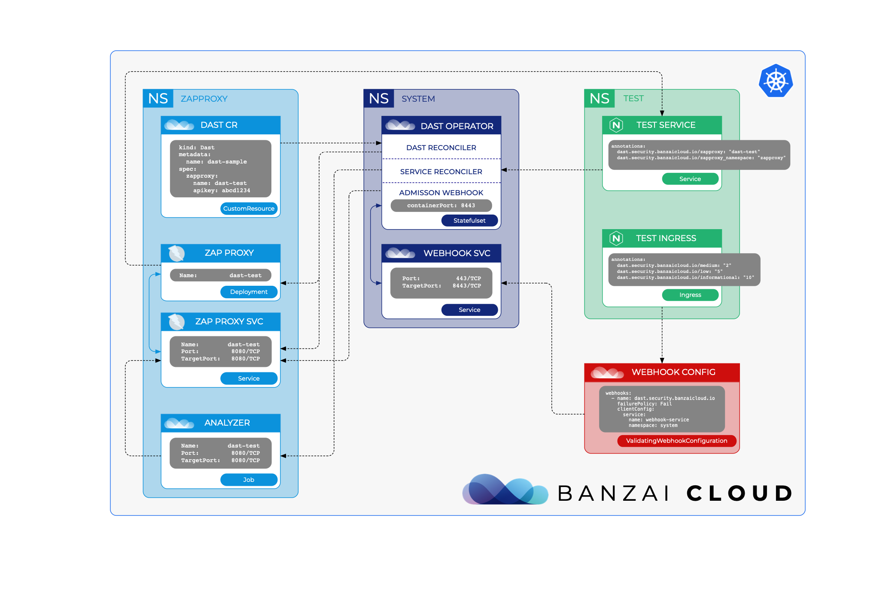

# DAST operator

> Dynamic application security testing (DAST) is a process of testing an application or software in an operating state.

This operator leverages [OWASP ZAP](https://www.zaproxy.org) to make automated security testing for web applications and APIs based on OpenAPI definitions.

### The operator current features:
- Deploy OWASP ZAP proxy defined in custom resource
- Scan external URL defined in custom resource
- Scan internal services based on its annotations
- API Security testing based on OpenAPI definition
- Before deploying ingress, check backend services whether scanned and scan results are below defined thresholds

### On the DAST operator roadmap:
- In webhook, check the scanner job is running, completed or not exist
- Improve service status check
- Handle multiple service ports
- Handle different service protocols
- Use HTTPS instead of HTTP connecting to ZAP
- Generate randomly ZAP API key if not defined
- API testing with JMeter and ZAP
- Parameterized security payload with fuzz
- Automated SQLi testing using SQLmap

## Structure of the DAST operator:
DAST operator running two reconcilers and one [validating admission webhook](https://kubernetes.io/docs/reference/access-authn-authz/admission-controllers/#validatingadmissionwebhook)



### Reconcilers
- DAST reconciler
- Service reconciler

### Webhook
- Validating webhook for ingress

## Current limitations:
Using the webhook feature, deploying an ingress is only successful when the backend service has been already scanned. If we deploy something with Helm that contains a service and an ingress definition as well, the ingress deployment will fail as to the scan progress of the backend service is not finished yet.

## Build images
```shell
git clone https://github.com/banzaicloud/dast-operator.git
cd dast-operator
make docker-build
make docker-analyzer
```

If you're using `Kind` cluster for testing, you will have to load images to it.
```shell
kind load docker-image banzaicloud/dast-operator:latest
kind load docker-image banzaicloud/dast-analyzer:latest
```

## Deploying the operator

First of all we need to deploy `cert-manager`
```shell
kubectl create namespace cert-manager
helm repo add jetstack https://charts.jetstack.io
helm repo update
kubectl apply --validate=false -f https://github.com/jetstack/cert-manager/releases/download/v1.0.4/cert-manager.crds.yaml
helm install cert-manager jetstack/cert-manager --namespace cert-manager --version v1.0.4
```

You can read more about the installation of the cert-manager in the [official documentation](https://cert-manager.io/docs/installation/kubernetes/)

Clone dast-operator
```shell
git clone https://github.com/banzaicloud/dast-operator.git
cd dast-operator
```

Deploy dast-operator
```shell
make deploy
```

## Examples

### Deploy OWASP ZAP
Deploy example CR
```shell
kubectl create ns zaproxy
kubectl apply -f config/samples/security_v1alpha1_dast.yaml -n zaproxy
```

Content of Dast custom resource:
```yaml
apiVersion: security.banzaicloud.io/v1alpha1
kind: Dast
metadata:
  name: dast-sample
spec:
  zaproxy:
    name: dast-test
    apikey: abcd1234
```

### Deploy the application and initiate active scan
```shell
kubectl create ns test
kubectl apply -f config/samples/test_service.yaml -n test
```

Content of `test_secvice.yaml`:
```yaml
apiVersion: apps/v1
kind: Deployment
metadata:
  name: test-deployment
  labels:
    app: nginx
spec:
  replicas: 1
  selector:
    matchLabels:
      app: nginx
      secscan: dast
  template:
    metadata:
      labels:
        app: nginx
        secscan: dast
    spec:
      containers:
      - name: nginx
        image: nginx:1.16.0-alpine
        ports:
        - containerPort: 80
---
apiVersion: v1
kind: Service
metadata:
  name: test-service
  annotations:
    dast.security.banzaicloud.io/zaproxy: "dast-test"
    dast.security.banzaicloud.io/zaproxy-namespace: "zaproxy"
spec:
  selector:
    app: nginx
    secscan: dast
  ports:
  - port: 80
    targetPort: 80
```

### Test the validating webhook

Deploy ingress with previously defined `test-service` backend.
```shell
kubectl apply -f config/samples/test_ingress.yaml -n test
```

Example ingress definition:
```yaml
apiVersion: extensions/v1beta1
kind: Ingress
metadata:
  name: test-ingress
  annotations:
    dast.security.banzaicloud.io/medium: "2"
    dast.security.banzaicloud.io/low: "5"
    dast.security.banzaicloud.io/informational: "10"
    nginx.ingress.kubernetes.io/rewrite-target: /
spec:
  rules:
  - http:
      paths:
      - path: /
        backend:
          serviceName: test-service
          servicePort: 80
```


### Scan external URL
```shell
kubectl create ns external
kubectl apply -f config/samples/security_v1alpha1_dast_external.yaml -n external
```

Content of DAST CR
```yaml
apiVersion: security.banzaicloud.io/v1alpha1
kind: Dast
metadata:
  name: dast-sample-external
spec:
  zaproxy:
    name: dast-test-external
    apikey: abcd1234
  analyzer:
    image: banzaicloud/dast-analyzer:latest
    name: external-test
    target: http://example.com
```


### Define OpenAPI definition as annotation in a service
```yaml
  apiVersion: v1
  kind: Service
  metadata:
    name: test-api-service
    annotations:
      dast.security.banzaicloud.io/zaproxy: "dast-test"
      dast.security.banzaicloud.io/zaproxy-namespace: "zaproxy"
      dast.security.banzaicloud.io/apiscan: "true"
      dast.security.banzaicloud.io/openapi-url: "https://raw.githubusercontent.com/sagikazarmark/modern-go-application/master/api/openapi/todo/openapi.yaml"
  spec:
    selector:
      app: mga
      secscan: dast
    ports:
    - port: 8000
      targetPort: 8000
```
